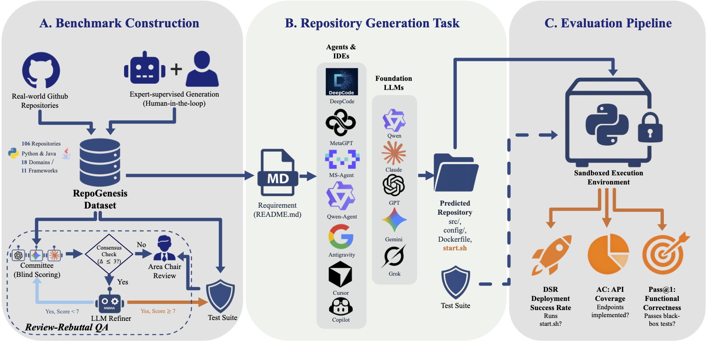

# RepoGenesis: Benchmarking End-to-End Microservice Generation from Readme to Repository 🚀

[//]: # ([![Project]&#40;http://img.shields.io/badge/Project-SER-E3E4C8.svg&#41;]&#40;https://microsoft.github.io/DKI_LLM/ser/ser_index.html&#41;)

[](https://arxiv.org/abs/2601.13943)
[](https://microsoft.github.io/DKI_LLM/RepoGenesis/RepoGenesis_index.html)
[](http://23.83.232.182:4090/)

## News 🔥
- April, 2026: our paper [RepoGenesis: Benchmarking End-to-End Microservice Generation from Readme to Repository](https://arxiv.org/abs/2601.13943) was accepted by ACL 2026 (Main) with a Top 15% of accepted papers.
- Feb, 2026: We released the [Leaderboard](http://23.83.232.182:4090/)! You can now check the latest evaluation results of different agents and IDEs.

This repository contains the code and data for RepoGenesis, the first multilingual benchmark for repository-level end-to-end web microservice generation. RepoGenesis assesses LLMs' capability in generating complete web microservice repositories from natural language requirements.

Refer to [the official github repo](https://github.com/microsoft/DKI_LLM/tree/main/RepoGenesis) for up-to-date information.


## Table of Contents

- [Overview](#overview)
- [Evaluation Metrics](#evaluation-metrics)
- [Installation](#installation)
- [Quick Start](#quick-start)
- [Evaluation Workflow](#evaluation-workflow)
  - [Step 1 — Generate Repositories](#step-1--generate-repositories)
  - [Step 2 — Docker-based Evaluation (Recommended)](#step-2--docker-based-evaluation-recommended)
  - [Step 3 — Legacy Script Evaluation](#step-3--legacy-script-evaluation)
  - [Step 4 — Aggregate and Reproduce Paper Results](#step-4--aggregate-and-reproduce-paper-results)
- [Development](#development)

## Overview ⭐

<div align="center">
  
</div>

RepoGenesis is the first benchmark for evaluating repository-level microservice generation from natural language requirements. Unlike existing benchmarks that focus on function-level or class-level code generation, RepoGenesis challenges LLMs to generate repositories from scratch.

**Key Features:**
- **11 frameworks** including Django, FastAPI, Javalin, Spring Boot, and more
- **18 application domains** covering authentication, content management, ***gaming***, file management, and more
- **Multi-dimensional metrics**: Pass@1 for functional correctness, API Coverage (AC) for implementation completeness, and Deployment Success Rate (DSR) for deployability
- **Docker-based isolated evaluation** via `eval_harness` — reproducible, hermetic, no conda required
- **Support for multiple agents**: MetaGPT , DeepCode , Qwen-Agent , MS-Agent , and commercial IDEs like Cursor  and Copilot 

## Installation

### Prerequisites

| Requirement | Version | Purpose |
|---|---|---|
| Python | 3.10+ | Orchestrator scripts |
| Docker | 20.10+ | Isolated evaluation (recommended) |
| Java JDK | 17+ | Java repo evaluation (legacy scripts) |
| Conda | Any | Isolated test envs (legacy scripts only) |
| Git | Any | Repository management |

### Install Python Dependencies

```bash
pip install -r requirements.txt
```

### Configure API Keys

```bash
export OPENAI_API_KEY="your-api-key"
export OPENAI_BASE_URL="your-base-url"   # optional, for custom endpoints
```

### Install Agent Frameworks (Optional)

Only needed if you want to run generation with a specific agent framework:

```bash
# MetaGPT
git clone https://github.com/FoundationAgents/MetaGPT.git && cd MetaGPT && pip install -e .

# DeepCode
git clone https://github.com/HKUDS/DeepCode.git && cd DeepCode && pip install -e .

# Qwen-Agent
git clone https://github.com/QwenLM/Qwen-Agent.git && cd Qwen-Agent && pip install -e .

# MS-Agent
git clone https://github.com/modelscope/ms-agent.git && cd ms-agent && pip install -e .
```

---

## Quick Start

The fastest path to evaluate a set of generated repos end-to-end:

```bash
# 1. Generate repos (example: MetaGPT on Blog)
python gen_and_eval.py \
    --agent metagpt \
    --repo_root ./my_generated_repos \
    --repo_name Blog \
    --llm_model gpt-4o \
    --llm_api_key $OPENAI_API_KEY

# 2. Evaluate with Docker harness (all 3 metrics, 30 verified repos)
python -m eval_harness.run_evaluation \
    --predictions_dir ./my_generated_repos \
    --output_dir ./eval_results

# 3. View the results
cat eval_results/report.json
```

---

## Evaluation Workflow

The evaluation pipeline consists of four stages. Stages 1–2 are the recommended path. Stage 3 (legacy scripts) is kept for reproducing earlier paper results.

```
┌─────────────────┐     ┌──────────────────────┐     ┌─────────────────────┐
│  1. Generation  │────▶│  2. Docker Harness   │────▶│  4. Report / Paper  │
│  (agent + LLM)  │     │  (DSR + Pass@1 + AC) │     │  Results            │
└─────────────────┘     └──────────────────────┘     └─────────────────────┘
                                   │
                          ┌────────┴────────┐
                          │  3. Legacy eval │
                          │  (optional)     │
                          └─────────────────┘
```

### Step 1 — Generate Repositories

#### For Python Repositories

```bash
# MetaGPT
python gen_and_eval.py \
    --agent metagpt \
    --repo_root repo \
    --repo_name <repository-name> \
    --llm_model gpt-4o \
    --llm_api_key $OPENAI_API_KEY
```

#### For Java Repositories (the same args with Python)

```bash
python gen_and_eval_Java.py \
    --agent <agent-name> \
    --repo_root repo_java \
    --repo_name <java-repository-name> \
    --llm_model gpt-4o \
    --llm_api_key $OPENAI_API_KEY
```
After generation, your `--repo_root` will contain one subdirectory per repo, each with the generated source code. This directory is then passed to the evaluation harness as `--predictions_dir`.

---

### Step 2 — Docker-based Evaluation (Recommended)

The `eval_harness` package provides a hermetic, Docker-based evaluation pipeline that computes all three metrics (DSR, Pass@1, AC) in a single command. Each repo is evaluated in its own container — no conda environments, no port conflicts, no dependency pollution between repos.

#### How it Works

```
predictions_dir/
└── <repo_name>/          ← agent-generated source code
    ├── start.sh
    ├── requirements.txt  (Python) or pom.xml (Java)
    └── ...

          │
          ▼ eval_harness
          
1. AC computed via static analysis (no Docker needed)
2. Docker image built:
   ├── Base image: python:3.10-slim or maven:3.9-eclipse-temurin-17
   ├── Generated repo copied in
   └── Golden oracle tests injected (overwrite any agent-generated tests)
3. Container runs entrypoint.sh:
   ├── Phase 1 — DSR: install deps → start server → health check
   │   └── Emits >>>>> DSR_START ... >>>>> DSR_END markers
   └── Phase 2 — Pass@1: run pytest (Python) or mvn test (Java)
       └── Emits >>>>> TEST_START ... >>>>> TEST_END markers
4. Container logs parsed → DSR + Pass@1 graded
5. Image removed; intermediate result saved for crash recovery
6. Final JSON report + summary table printed
```

#### Run the Full Evaluation

```bash
python -m eval_harness.run_evaluation \
    --predictions_dir ./generated \
    --output_dir ./eval_results
```

#### Common Options

| Flag | Default | Description |
|---|---|---|
| `--predictions_dir` | *(required)* | Directory of generated repos (one subdir per repo) |
| `--output_dir` | `eval_results/` | Where to write `report.json` and intermediate results |
| `--repo_names Blog flask` | all found | Evaluate only specific repos |
| `--lang python` | all | Filter to `python` or `java` repos only |
| `--skip_docker` | off | Compute AC only, skip Docker (no DSR/Pass@1) |
| `--resume` | off | Resume from a previously interrupted run |
| `--keep_images` | off | Do not remove Docker images after evaluation |
| `--no_cache` | off | Build Docker images with `--no-cache` |
| `--verbose` / `-v` | off | Stream container logs + DEBUG logging |
| `--log_file eval.log` | none | Also write logs to a file |
| `--model_name gpt-4o` | none | Record model name in report metadata |
| `--agent_name metagpt` | none | Record agent name in report metadata |
| `--cleanup` | — | Remove all eval containers/images and exit |
| `--timeout` | 900 | Per-container timeout in seconds |

#### Example: Evaluate a Single Repo with Verbose Output

```bash
python -m eval_harness.run_evaluation \
    --predictions_dir ./generated \
    --repo_names Blog \
    --output_dir ./eval_results \
    --verbose \
    --model_name gpt-4o \
    --agent_name metagpt
```

#### Example: AC-only Evaluation (No Docker Required)

```bash
python -m eval_harness.run_evaluation \
    --predictions_dir ./generated \
    --skip_docker \
    --output_dir ./eval_results
```

#### Example: Resume an Interrupted Run

Intermediate results are saved after each repo under `eval_results/intermediate/<repo_name>.json`. If the run crashes, resume it:

```bash
python -m eval_harness.run_evaluation \
    --predictions_dir ./generated \
    --output_dir ./eval_results \
    --resume
```

#### Output Format

The final report is written to `eval_results/report.json`:

```jsonc
{
  "metadata": {
    "timestamp": "2026-02-25T12:00:00",
    "harness_version": "1.0.0",
    "model_name": "gpt-4o",
    "agent_name": "metagpt",
    "total_elapsed_seconds": 1234.5,
    "predictions_dir": "./generated"
  },
  "summary": {
    "total_repos": 30,
    "python_repos": 22,
    "java_repos": 8,
    "avg_pass_at_1": 0.4123,
    "avg_api_coverage": 0.7654,
    "deployment_success_rate": 0.6000,
    "pass_at_1_by_lang": { "python": 0.4500, "java": 0.3200 },
    "ac_by_lang":         { "python": 0.8100, "java": 0.6800 },
    "dsr_by_lang":        { "python": 0.6364, "java": 0.5000 }
  },
  "results": [
    {
      "repo_name": "Blog",
      "lang": "python",
      "port": 8000,
      "framework": "fastapi",
      "exit_code": 0,
      "elapsed_seconds": 47.2,
      "dsr": { "success": true, "message": "Service started successfully" },
      "pass_at_1": { "passed": 8, "failed": 2, "errors": 0, "skipped": 0, "total": 10, "score": 0.8 },
      "api_coverage": { "total_apis": 5, "implemented_apis": 4, "score": 0.8 }
    }
  ]
}
```

A human-readable summary table is also printed to stdout:

```
==========================================================================================
  RepoGenesis Evaluation Results
==========================================================================================
Repo Name                           Lang     DSR    Pass@1     AC
------------------------------------------------------------------------------------------
Blog                                python   PASS   8/10 (0.80) 4/5 (0.80)
flask                               python   PASS   6/8 (0.75)  3/4 (0.75)
javalin-online-judge                java     FAIL   0/6 (0.00)  2/4 (0.50)
...
------------------------------------------------------------------------------------------
  Total repos:              30
  Avg Pass@1:               0.4123
  Deployment Success Rate:  0.6000
  Avg API Coverage:         0.7654

  Pass@1 (Python):  0.4500  | Pass@1 (Java):  0.3200
  DSR (Python):     0.6364  | DSR (Java):     0.5000
  AC (Python):      0.8100  | AC (Java):      0.6800
==========================================================================================
```

#### Timeouts Reference

| Stage | Python | Java |
|---|---|---|
| Dependency install / build | 120 s | 300 s |
| Service startup | 15 s | 20 s |
| Test suite execution | 300 s | 600 s |
| Overall container timeout | 900 s | 900 s |

---

### Step 3 — Legacy Script Evaluation

These scripts are retained for reproducing results from the original paper. They require conda and run without Docker.

#### Pass@1 — Python

```bash
python evaluate_repos.py \
    --answer_dir <path-to-generated-repos> \
    --test_dir repo_golden_oracle \
    --output evaluation_results.json
```

Steps performed internally:
1. Install repo dependencies (`pip install -r requirements.txt`)
2. Start the service via `start.sh` (10 s startup wait)
3. Run `pytest tests/` with a 300 s timeout
4. Kill the service and clean up ports
5. Save per-repo Pass@1, coverage, and code metrics to JSON

#### Pass@1 — Java

```bash
python evaluate_repos_java.py \
    --answer_dir <path-to-generated-repos> \
    --test_dir <golden-oracle-java-dir> \
    --output evaluation_results_java.json
```

#### API Coverage (AC)

```bash
# All agent configurations
python calculate_api_coverage.py

# IDE-specific configurations
python calculate_api_coverage_ide.py

# Open-source agent configurations
python calculate_api_coverage_agents.py
```

#### Deployment Success Rate (DSR)

```bash
# Python repos
python test_dsr_repos.py

# Java repos
python exps/test_dsr.py

# Both Python and Java
python exps/test_all_dsr.py

# Shell-based DSR runner
bash exps/test_dsr.sh
```

---

### Step 4 — Aggregate and Reproduce Paper Results

1. **Generate** repositories for all agent/model configurations using the scripts in Step 1.
2. **Evaluate** each configuration using the Docker harness (Step 2) or legacy scripts (Step 3).
3. **Collect** the `report.json` files from each `--output_dir`.
4. **Compare** `summary.avg_pass_at_1`, `summary.deployment_success_rate`, and `summary.avg_api_coverage` across configurations.

The LLM-based scoring workflow (used in the paper for qualitative evaluation) can be run separately:

```bash
python -m evaluation.run_eval \
    --repo-root repo_readme \
    --output results.json
```

## Evaluation Metrics

### Pass@1 (Functional Correctness)

Measures whether the generated repository passes all test cases on the first attempt:

```
Pass@1 = (Number of passed test cases) / (Total test cases)
```

A repository achieves Pass@1 = 1.0 only if all test cases pass.

### API Coverage (AC)

Measures implementation completeness by checking if all required API endpoints are present:

```
AC = (Number of implemented API endpoints) / (Total required API endpoints)
```

API endpoints are extracted from README specifications and validated in the generated code.

### Deployment Success Rate (DSR)

Measures basic deployability by checking if:
1. Dependencies can be installed
2. Service can start without errors
3. Health check endpoint responds


## Development

### Running the Harness Test Suite

```bash
# Run all 200 unit tests for eval_harness
python -m pytest eval_harness/tests/ -v --import-mode=importlib

# Run a specific test module
python -m pytest eval_harness/tests/test_grading.py -v --import-mode=importlib

# Run with coverage
python -m pytest eval_harness/tests/ --cov=eval_harness --cov-report=term-missing \
    --import-mode=importlib
```

### Running Legacy Unit Tests

```bash
python -m unittest test_evaluate_repos.py -v
```

### Code Style

- Python 3.10+, PEP 8, 4-space indentation, max ~100 chars per line
- Type hints on all function signatures (`Optional`, `Tuple`, `Dict`, `List` from `typing`)
- Use `pathlib.Path` for all filesystem paths
- Follow TDD: write or update tests before implementing new functionality
- When adding a new evaluation script, mirror the structure of existing ones: `argparse` for CLI, JSON output, `print`-based logging

### Adding a New Benchmark Repo

1. Add the repo spec to `eval_harness/constants.py`:

```python
REPO_SPECS["my-new-service"] = {
    "lang": "python",   # or "java"
    "port": 8080,
    "framework": "fastapi",
}
```

2. Add the README to `repo_readme_verified_python_no_t/my-new-service/README.md`.
3. Add golden oracle tests to `repo_readme_verified/my-new-service/tests/`.
4. Update `TOTAL_PYTHON_REPOS` (or `TOTAL_JAVA_REPOS`) in `constants.py`.
5. Add a test row to `eval_harness/tests/test_constants.py`.


## Citation
If you find this repository useful, please considering giving ⭐ or citing:
```bibtex
@misc{peng2026repogenesisbenchmarkingendtoendmicroservice,
      title={RepoGenesis: Benchmarking End-to-End Microservice Generation from Readme to Repository}, 
      author={Zhiyuan Peng and Xin Yin and Pu Zhao and Fangkai Yang and Lu Wang and Ran Jia and Xu Chen and Qingwei Lin and Saravan Rajmohan and Dongmei Zhang},
      year={2026},
      eprint={2601.13943},
      archivePrefix={arXiv},
      primaryClass={cs.SE},
      url={https://arxiv.org/abs/2601.13943}, 
}
```


## Contributing

This project welcomes contributions and suggestions.

## Question

If you want to contact the author, please email: `pzy2000@sjtu.edu.cn` and `xyin@zju.edu.cn`.
